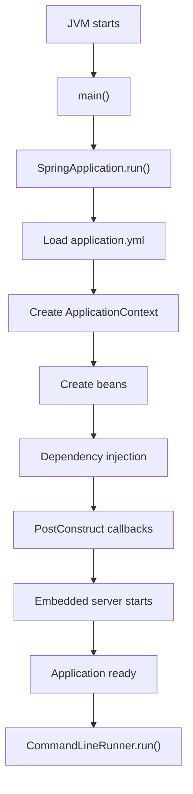

# 🚀 Spring Boot Fundamentals 

---

# 📚 Evolution

```text
Java → Java EE (Servlets, JSP) → Spring Framework → Spring Boot
```

**Spring Boot is not a replacement for Spring**; it is built on top of Spring Framework.

---

# 🌱 Spring Framework

Spring helps you focus on **business logic** instead of infrastructure.

It provides:

* IoC Container
* Dependency Injection (DI)
* Spring MVC
* Spring Data
* AOP
* Security integration
* Transaction management

Example:

```java
// Without Spring
UserService service = new UserService(new UserRepository());

// With Spring
@Autowired
private UserService service;
```

Spring creates and injects the object for you.

---

# 😫 Problem with Traditional Spring

Even a simple REST API used to need a lot of setup:

* `web.xml`
* `DispatcherServlet`
* Tomcat
* component scanning
* Jackson
* XML configuration
* dependency wiring

Too much boilerplate.

---

# 🚀 Spring Boot

Spring Boot says: **configure the common parts automatically**.

Instead of many config files, you usually only need:

```java
@SpringBootApplication
public class Application {
    public static void main(String[] args) {
        SpringApplication.run(Application.class, args);
    }
}
```

---

# ⭐ Why Spring Boot?

## Auto Configuration

Add a starter like:

```xml
spring-boot-starter-web
```

Spring Boot configures things like:

* `DispatcherServlet`
* Jackson
* embedded Tomcat
* Spring MVC
* error handling

## Starter Dependencies

Instead of adding many individual libraries, use one starter such as `spring-boot-starter-web`.

## Embedded Server

No separate Tomcat install is needed. Run:

```bash
java -jar app.jar
```

## Production Ready

Spring Boot Actuator adds health checks, metrics, monitoring, and logging support.

---

# 🏗️ What is `@SpringBootApplication`?

It combines three annotations:

```java
@Configuration
@EnableAutoConfiguration
@ComponentScan
```

### `@Configuration`

Marks a class as a source of bean definitions.

### `@EnableAutoConfiguration`

Automatically configures Spring based on the dependencies present. For example, if JPA is on the classpath, Spring Boot configures Hibernate, `EntityManager`, `DataSource`, and transaction support.

### `@ComponentScan`

Finds Spring components such as:

* `@Controller`
* `@RestController`
* `@Service`
* `@Repository`
* `@Component`

and registers them as beans.

---

# ▶️ What does `SpringApplication.run()` do?

```java
SpringApplication.run(Application.class, args);
```

Startup flow:

```text
Read configuration → Create IoC container → Component scan → Auto configuration → Create beans → Start embedded Tomcat → Application ready
```

---

# 🌍 Why do we need a Server?

Java code alone cannot receive HTTP requests.

```java
@RestController
public class HelloController {
    @GetMapping("/hello")
    public String hello() {
        return "Hello";
    }
}
```

When a browser sends `GET /hello`, a web server receives the request first.

---

# 🖥️ What is an Embedded Server?

An embedded server is packaged **inside your application**.

Traditional deployment:

```text
Application → WAR → Deploy to Tomcat → Run
```

Spring Boot:

```text
Application → Embedded Tomcat → java -jar app.jar
```

Everything runs in one JAR.

---

# 🔄 Request Lifecycle

```text
Browser → Embedded Tomcat → DispatcherServlet → Controller → Service → Repository → Database → Response → Browser
```

---

# ☕ What is the JVM?

The JVM runs Java bytecode. It handles:

* code execution
* memory management
* garbage collection
* thread management
* class loading

It does **not** natively handle web concerns like HTTP, URLs, browsers, or cookies.

---

# 🤔 Can the JVM handle HTTP?

Yes, but only with manual work.

You can open a socket, but then you must implement HTTP parsing, headers, cookies, sessions, routing, thread pools, error handling, and responses yourself.

That is why servers like Tomcat exist.

---

# 🎯 Why Tomcat?

Tomcat already handles the low-level web-server work:

```text
TCP → HTTP parsing → headers → cookies → sessions → thread pools → routing → response
```

So your app can focus on business logic.

---

# 🔍 Layer Architecture

```text
Operating System
JVM
Embedded Tomcat
Spring MVC
Your Controllers
```

| Component | Responsibility |
| --- | --- |
| Operating System | Hardware and networking |
| JVM | Runs bytecode, memory, GC, threads |
| Tomcat | Handles HTTP and request/response handling |
| Spring | IoC, DI, MVC, bean management |
| Your Code | Business logic |

---

# 🎭 Real-World Analogy

Think of a restaurant:

* Receptionist = Tomcat
* Chef = Spring + your code
* Food served = HTTP response

---

# 🎯 Spring vs Spring Boot

| Spring Framework | Spring Boot |
| --- | --- |
| Core framework | Built on Spring |
| Manual configuration | Auto configuration |
| External server | Embedded server |
| Manual dependency setup | Starter dependencies |
| More setup | Minimal setup |
| Flexible | Opinionated defaults |

---

# 💡 Key Takeaways

* Spring provides IoC, DI, MVC, and more.
* Spring Boot reduces setup and gives sensible defaults.
* The JVM runs Java bytecode; it is not a web server.
* Tomcat is a web server and Servlet container that handles HTTP.
* Embedded Tomcat means the server ships with your app.
* `@SpringBootApplication` combines `@Configuration`, `@EnableAutoConfiguration`, and `@ComponentScan`.
* `SpringApplication.run()` starts the Spring context and embedded server.
* Tomcat handles HTTP, Spring handles application logic, and the JVM runs both.


# 🌱 Spring Boot Essentials - Profiles, Configuration & Startup


---

# 📚 Topics Covered

- 🧩 `spring-boot-starter-parent`
- ⚙️ `@ConfigurationProperties`
- 🎯 Spring Profiles
- 📈 Property Priority
- 🚀 `CommandLineRunner`

---

# 🧩 `spring-boot-starter-parent`

A parent Maven POM that provides:

- ✅ Compatible dependency versions
- ✅ Plugin management
- ✅ Java compiler configuration
- ✅ Maven defaults
- ✅ Reduced boilerplate

```xml
<parent>
    <groupId>org.springframework.boot</groupId>
    <artifactId>spring-boot-starter-parent</artifactId>
</parent>
```

### Without Parent

❌ Specify versions manually

```xml
<dependency>
    <version>...</version>
</dependency>
```

### With Parent

✅ Spring Boot manages versions

```xml
<dependency>
    <artifactId>spring-boot-starter-web</artifactId>
</dependency>
```

---

# ⚙️ `@ConfigurationProperties`

Maps properties from `application.yml` into a POJO.

```yaml
app:
  name: Demo
```

```java
@ConfigurationProperties(prefix = "app")
public class AppProperties {
    private String name;
}
```

## Ways to Register

### 1️⃣ Using `@Component`

```java
@Component
@ConfigurationProperties(prefix = "app")
```

✔ No extra configuration required.

---

### 2️⃣ Using `@EnableConfigurationProperties` and `@ConfigurationProperties(prefix="app")`

```java
@SpringBootApplication
@EnableConfigurationProperties(AppProperties.class)
```

✔ Registers the properties bean explicitly.

---

### 3️⃣ Using `@ConfigurationPropertiesScan` and `@ConfigurationProperties(prefix="app")`⭐ (Recommended)

```java
@SpringBootApplication
@ConfigurationPropertiesScan
```

✔ Automatically scans all `@ConfigurationProperties` classes.

---

### ❓Do we need `@Configuration`?

**No.**

Use `@Configuration` only for classes containing `@Bean` methods.

---

# 🎯 Spring Profiles

Example:

```yaml
spring:
  profiles:
    active: dev
```

If no profile is passed during startup:

```bash
java -jar app.jar
```

Spring loads:

```
application.yml
        +
application-dev.yml
```

✔ Active Profile → **dev**

---

If nothing is configured:

```
Active Profile → default
```

---

If passed externally:

```bash
java -jar app.jar --spring.profiles.active=prod
```

✔ Active Profile → **prod**

---

# 📈 Property Priority

Highest → Lowest

```text
Command Line (--...)
        │
Java System Properties (-D...)
        │
Environment Variables
        │
External application.yml
        │
Internal application.yml
        │
@PropertySource
        │
Default Values
```

> **Nearest to runtime wins.**

---

# 🚀 `CommandLineRunner`

Spring Boot interface executed **after the application is fully started**.

```java
@Component
public class StartupRunner implements CommandLineRunner {

    @Override
    public void run(String... args) {
        System.out.println("Application Started!");
    }
}
```

## Common Uses

- 🌱 Seed initial data
- 📦 Load cache
- 🔍 Startup validation
- 📊 Logging
- ⚙️ One-time initialization

---

# ⏱ Startup Lifecycle



---

# 📝 Quick Revision

| Topic | Key Point |
|--------|-----------|
| 🌱 Starter Parent | Manages dependency & plugin versions |
| ⚙️ Configuration Properties | Maps YAML/Properties → Java POJO |
| 🏷 `@Component` | Automatically registers property bean |
| 🏷 `@EnableConfigurationProperties` | Registers bean manually |
| 🏷 `@ConfigurationPropertiesScan` | Auto-discovers all property classes ⭐ |
| 🚫 `@Configuration` | Not needed unless defining `@Bean`s |
| 🎯 Active Profile | `application.yml` value is used if nothing higher overrides it |
| 📈 Property Priority | Command Line > System Props > Env Vars > Config Files |
| 🚀 CommandLineRunner | Runs **after** the entire Spring Boot application is ready |

---

## 💡 Key Takeaways

- 📦 **Starter Parent** removes Maven boilerplate.
- ⚙️ **`@ConfigurationProperties`** cleanly binds configuration to POJOs.
- 🎯 **Profiles** let you switch configurations for different environments.
- 📈 **External configuration overrides internal configuration.**
- 🚀 **`CommandLineRunner`** is perfect for startup initialization after Spring Boot is fully ready.

