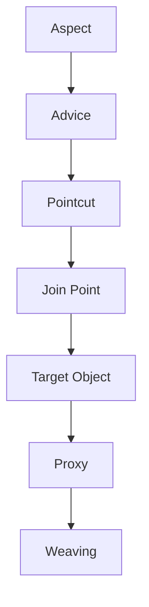
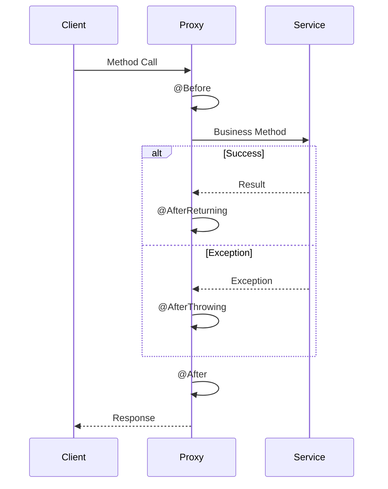
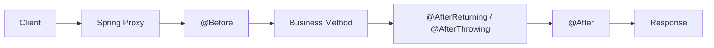
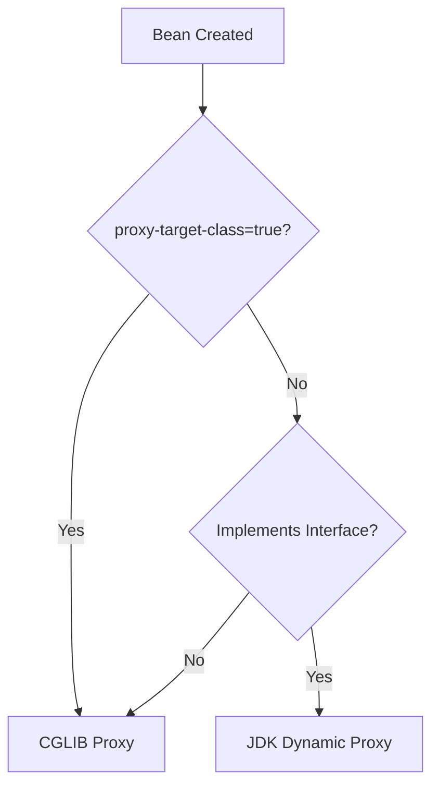
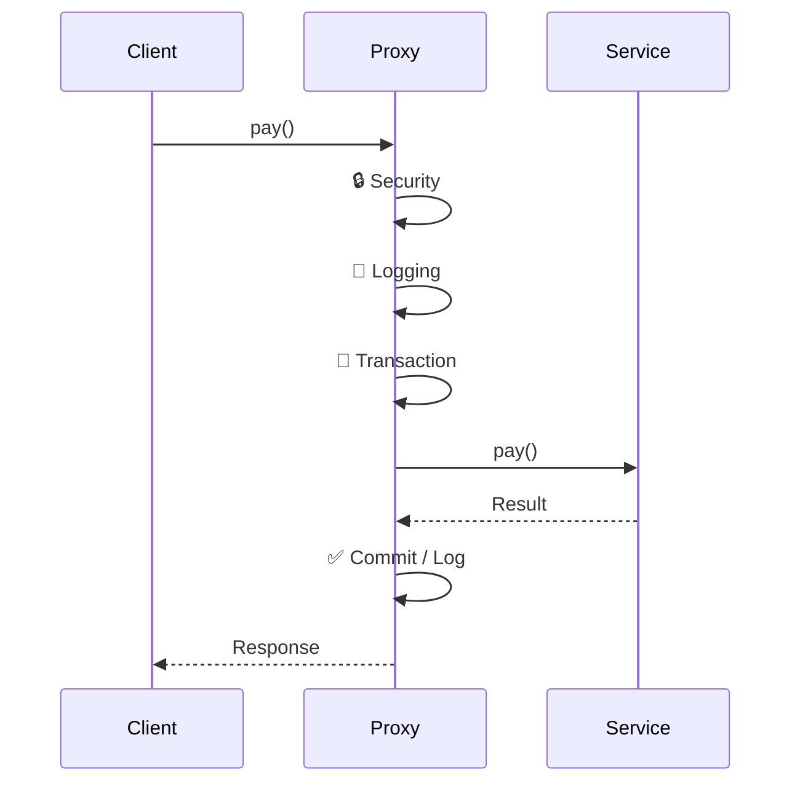

# 🎭 Spring AOP (Aspect-Oriented Programming)

> **AOP separates cross-cutting concerns (Logging, Security, Transactions, etc.) from business logic, keeping code clean, reusable, and maintainable.**

---

## 🤔 Why AOP?

Without AOP, every service contains repeated code.

```java
public void transferMoney() {
    authenticate();
    log.info("Started");

    // Business Logic

    log.info("Completed");
}
```

After AOP:

```java
public void transferMoney() {
    // Business Logic Only ✅
}
```

Spring automatically handles:

* 📝 Logging
* 🔒 Security
* 💾 Transactions
* ⚡ Caching
* 📊 Monitoring
* 📋 Auditing
* ❗ Exception Handling

---

## ✂️ Cross-Cutting Concerns

These are functionalities used across multiple modules.

```text
             Cross-Cutting Concerns
                     │
     ┌───────────────┼───────────────┐
     │               │               │
  📝 Logging     🔒 Security     💾 Transaction
     │               │               │
     └───────────────┼───────────────┘
                     │
      Applied to Multiple Services
```

Instead of duplicating them everywhere, AOP lets us write them **once** and reuse them automatically.

---

# 🏗️ Core Components of AOP



---

## 🎭 Aspect

An **Aspect** is a class that contains cross-cutting logic.

```java
@Aspect
@Component
public class LoggingAspect {
}
```

Examples:

* 📝 Logging
* 🔒 Security
* 💾 Transactions

---

## ⚡ Advice

**Advice = What should happen?**

| Advice            | Executes                             |
| ----------------- | ------------------------------------ |
| `@Before`         | Before method execution              |
| `@After`          | After method execution (always)      |
| `@AfterReturning` | After successful execution           |
| `@AfterThrowing`  | When an exception occurs             |
| `@Around`         | Before **and** after (most powerful) |

```text
@Before
    │
    ▼
Business Method
    │
    ▼
@After
```

---

## 🎯 Join Point

A **Join Point** is a place where advice **can** be applied.

In **Spring AOP**, a join point is **a method execution**.

```java
saveUser()
updateUser()
deleteUser()
```

Each method execution is a Join Point.

---

## 🎯 Pointcut

A **Pointcut** decides **which Join Points** should receive the advice.

```java
execution(* com.demo.service.*.*(..))
```

Meaning:

```text
All methods
        │
        ▼
Inside com.demo.service package
```

---

## 🎯 Target Object

The actual bean containing the business logic.

```java
@Service
public class UserService {

    public void saveUser() {
        // Business Logic
    }
}
```

---

## 🎭 Proxy

Spring never directly exposes the target bean.

```text
Client
   │
   ▼
Spring Proxy
   │
   ▼
Target Bean
```

The proxy intercepts every method call and executes the required advice.

---

## 🧵 Weaving

**Weaving = Combining the Aspect with the Target Object.**

Spring performs weaving by creating a **proxy** around the target bean.

### Types of Weaving

| Type                 | When                           |
| -------------------- | ------------------------------ |
| Compile-Time         | During compilation             |
| Load-Time            | While loading classes into JVM |
| Runtime (Spring AOP) | During bean creation (Proxy)   |

---

# ⚙️ Spring AOP Flow



---

## 💻 Example

### Service

```java
@Service
public class PaymentService {

    public void pay() {
        System.out.println("Payment Done");
    }
}
```

### Aspect

```java
@Aspect
@Component
public class LoggingAspect {

    @Before("execution(* com.demo.service.*.*(..))")
    public void before() {
        System.out.println("Started");
    }

    @After("execution(* com.demo.service.*.*(..))")
    public void after() {
        System.out.println("Completed");
    }
}
```

### Output

```text
Started
Payment Done
Completed
```

---

# 🚀 Where is AOP Used?

| Feature             | Purpose                        |
| ------------------- | ------------------------------ |
| 💾 `@Transactional` | Transaction Management         |
| ⚡ `@Cacheable`      | Caching                        |
| 🔄 `@Retryable`     | Retry Failed Operations        |
| 🧵 `@Async`         | Asynchronous Execution         |
| 🔐 Spring Security  | Authorization & Authentication |
| 📝 Logging          | Request & Method Logging       |
| 📋 Auditing         | Track Changes                  |
| 📊 Monitoring       | Performance Metrics            |

---

# ✅ Advantages

* ♻️ Eliminates duplicate code
* 🧹 Cleaner business logic
* 🔧 Easier maintenance
* 📦 Better code reusability
* 📖 Improved readability
* 🎯 Centralized cross-cutting concerns

---

# ⚠️ Limitations

* Works **only** with Spring-managed beans.
* Supports **method execution** join points only.
* **Self-invocation** bypasses the proxy, so advice is **not** applied.

---

# 🧠 Quick Revision

| Concept       | Remember                                    |
| ------------- | ------------------------------------------- |
| 🎭 Aspect     | Class containing cross-cutting logic        |
| ⚡ Advice      | What should happen                          |
| 🎯 Join Point | Where advice can execute (method execution) |
| 🎯 Pointcut   | Which methods should receive advice         |
| 🎯 Target     | Original business object                    |
| 🎭 Proxy      | Wrapper that intercepts method calls        |
| 🧵 Weaving    | Combining Aspect + Target using Proxy       |

---

# 🎯 AOP Lifecycle



---

# 📝 One-Line Summary
> **Spring AOP uses proxies to automatically apply reusable cross-cutting concerns (Logging, Security, Transactions, Caching, etc.) around business methods, resulting in cleaner, modular, and maintainable applications.** 🚀


---

# 🎭 Spring AOP Proxies - Quick Revision Guide

> **Proxy = A wrapper object created by Spring that intercepts method calls to add extra behavior (Logging, Transactions, Security, Caching, etc.) without modifying your business code.**

---

## 🎯 Why do we need a Proxy?

Without AOP:

```text
Client
   │
   ▼
Business Method
```

With AOP:

```text
Client
   │
   ▼
┌───────────────┐
│ Spring Proxy  │
├───────────────┤
│ 🔒 Security   │
│ 📝 Logging    │
│ 💾 Transaction│
│ ⚡ Caching    │
└───────┬───────┘
        │
        ▼
 Business Method
```

The **proxy intercepts every method call**, executes the required advice, and then delegates the call to the actual object.

---

## 🏗️ Proxy Types

### 1️⃣ JDK Dynamic Proxy

✅ Used when the target class **implements an interface**.

```text
        Interface
            ▲
            │
     JDK Proxy
            │
            ▼
 Implementation
```

Example:

```java
public interface PaymentService {
    void pay();
}

@Service
public class PaymentServiceImpl implements PaymentService {
    public void pay() { }
}
```

Spring generates something similar to:

```java
class PaymentServiceProxy implements PaymentService {

    private PaymentService target;

    @Override
    public void pay() {
        before();
        target.pay();
        after();
    }
}
```

### ✔️ Pros

* Lightweight
* Built into Java (`java.lang.reflect.Proxy`)

### ❌ Limitations

* Requires an interface
* Can intercept only interface methods

---

### 2️⃣ CGLIB Proxy

✅ Used when the target class **does not implement an interface**.

```text
 Original Class
       ▲
       │
 CGLIB Subclass
```

Example:

```java
@Service
public class PaymentService {

    public void pay() { }
}
```

Spring generates something similar to:

```java
class PaymentServiceProxy extends PaymentService {

    @Override
    public void pay() {
        before();
        super.pay();
        after();
    }
}
```

### ✔️ Pros

* No interface required
* Can proxy concrete classes

### ❌ Limitations

* Cannot proxy `final` classes
* Cannot override `final` methods

---

## 🤔 How Spring Chooses?



> **Spring Boot Default:** `proxy-target-class=true` ✅
> Therefore, **CGLIB** is commonly used by default.

---

## ⚙️ Bean Creation Flow

```mermaid
flowchart LR
    A[Create Bean] --> B{AOP Needed?}
    B -->|No| C[Store Bean]
    B -->|Yes| D[Generate Proxy]
    D --> E[Store Proxy in IoC Container]
    E --> F[@Autowired Injects Proxy]
```

---

## 🚀 Runtime Flow



---

## 📊 JDK vs CGLIB

| Feature                           | JDK Proxy    | CGLIB                   |
| --------------------------------- | ------------ | ----------------------- |
| Requires Interface                | ✅            | ❌                       |
| Proxies                           | Interface    | Concrete Class          |
| Mechanism                         | `implements` | `extends`               |
| Can proxy class without interface | ❌            | ✅                       |
| Supports `final` class            | ❌            | ❌                       |
| Supports `final` methods          | ❌            | ❌                       |
| Built into Java                   | ✅            | ❌ (Bytecode Generation) |
| Spring Boot Default               | ❌            | ✅                       |

---

## 💡 Remember This

### JDK Proxy

```text
Interface
      ▲
      │
Proxy implements Interface
      │
      ▼
Implementation
```

### CGLIB

```text
Original Class
       ▲
       │
Proxy extends Class
```

---

## 🧠 Interview One-Liners

* 🎭 **Proxy** → Wrapper around the target object.
* 🔍 **Purpose** → Add cross-cutting concerns without changing business code.
* 🛠️ **JDK Proxy** → Works only with interfaces.
* 🧬 **CGLIB** → Creates a subclass of the target class.
* 🚫 **Final classes/methods** cannot be proxied using subclassing.
* 🌱 **Spring Boot** typically uses **CGLIB** by default (`proxy-target-class=true`).
* 📦 The **IoC container stores the proxy**, so `@Autowired` injects the proxy—not the original bean.

---

## 🎯 One-Line Summary

> **Spring AOP works by creating a proxy around your bean. The proxy intercepts method calls, executes cross-cutting concerns (Logging, Transactions, Security, etc.), delegates the call to the real object, and returns the result—all without modifying your business logic.**
