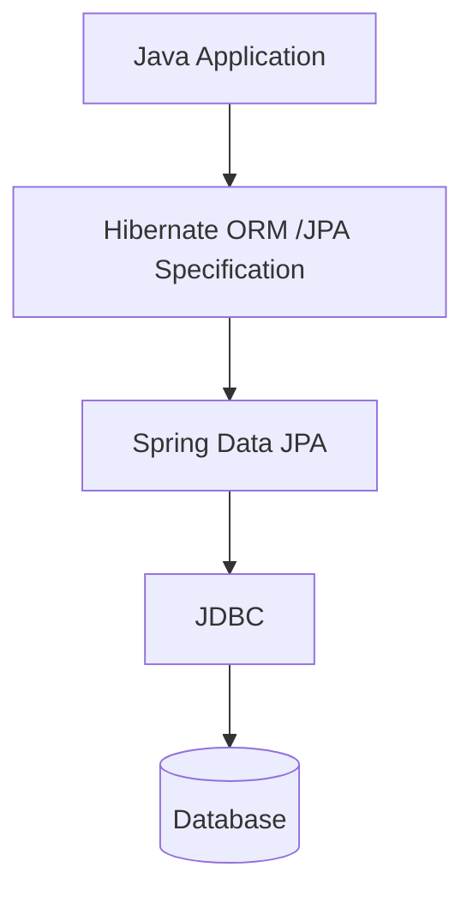
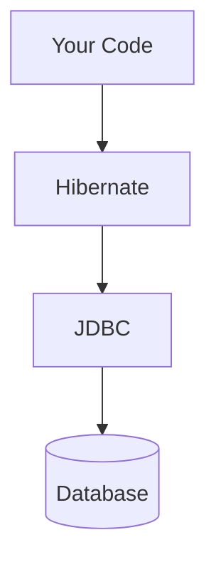
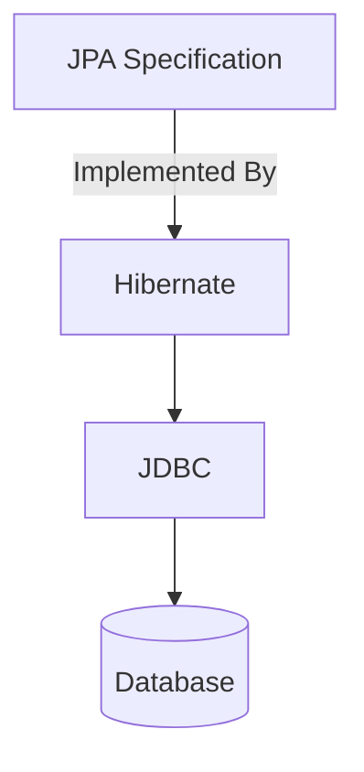
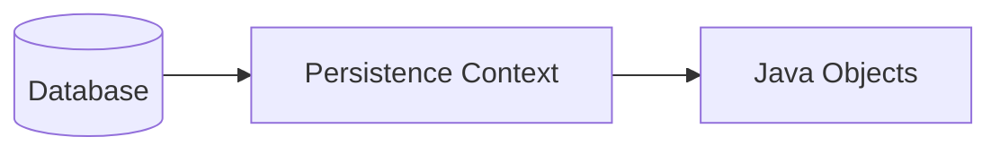
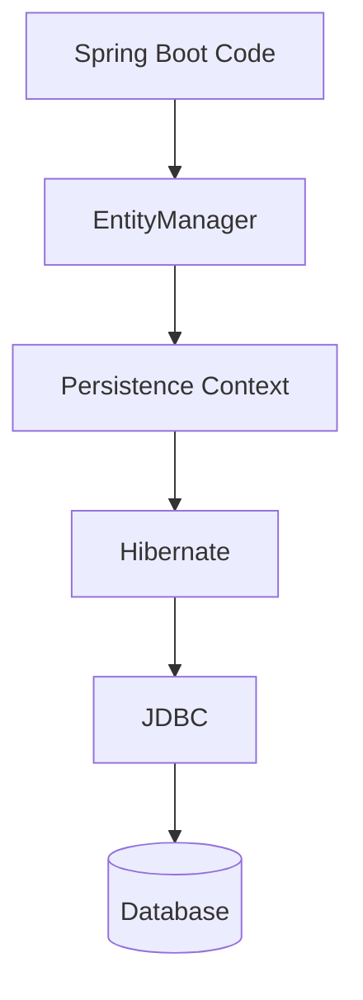
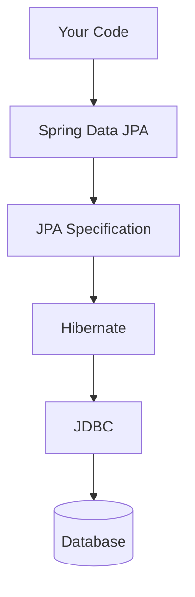
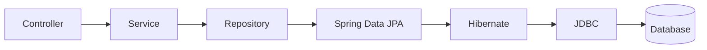

# ☕ JDBC → JPA → Hibernate 🚀

A quick revision guide for understanding how Java communicates with a database.

---

## 🏗️ Evolution



> **Remember:** Everything eventually reaches the **Database through JDBC**.

---

# 🔌 JDBC (Java Database Connectivity)

**Purpose:** Provides a standard API for Java applications to communicate with relational databases.

### Responsibilities
- 🔗 Open database connections
- 📤 Execute SQL
- 📥 Read query results
- ❌ Close resources

```text
Java
  │
JDBC
  │
JDBC Driver
  │
Database
```

### Common Components

| Component | Purpose |
|-----------|---------|
| `Driver` | Talks to a specific database |
| `Connection` | Database connection |
| `Statement` | Executes SQL |
| `PreparedStatement` | Parameterized & secure SQL |
| `ResultSet` | Holds query results |

---

# 📦 ORM (Object Relational Mapping)

Instead of manually converting rows into Java objects,

```text
Database Row  ⇄  Java Object
```

an ORM does it automatically.

---

# ⚡ Hibernate

Hibernate is an **ORM Framework** implementation of **JPA** .

✅ Maps Java Objects ↔ Database Tables

Instead of writing SQL manually,

```java
User user = entityManager.find(User.class, 1L);
```

Hibernate internally generates SQL and executes it using **JDBC**.



---

# 📜 JPA (Java Persistence API)

> **JPA is NOT a framework.**

It is a **Specification (Contract)**.

Hibernate is one of its implementations.



**Think of it like:**

```java
interface Vehicle {}   // JPA
class Car implements Vehicle {}   // Hibernate
```

---

# 🧩 Entity

A Java class mapped to a database table.

```java
@Entity
class User {
    @Id
    Long id;
    String name;
}
```

```text
User Object
      ⇅
users Table
```

---

# 🎯 EntityManager

The **main API provided by JPA** to manage entities.

Common operations:

- ➕ `persist()`
- 🔍 `find()`
- ✏️ `merge()`
- ❌ `remove()`

```text
Your Code
     │
EntityManager
     │
Hibernate
     │
JDBC
     │
Database
```

---

# 🗂️ Persistence Context

A **temporary cache of managed entities**.



### Benefits

- ⚡ First-Level Cache
- 👀 Tracks entity changes
- 🔄 Automatic synchronization

---

# 🧹 Dirty Checking

After loading an entity,

```java
User user = entityManager.find(User.class, 1L);

user.setName("John");
```

No explicit `update()` is needed.

On transaction commit:

```sql
UPDATE users
SET name='John'
WHERE id=1;
```

Hibernate detects the change and executes the SQL automatically.

---

# 🎨 Complete Flow



---

# 📌 Quick Revision

| Component | Purpose |
|-----------|---------|
| 🔌 JDBC | Execute SQL & communicate with DB |
| 📜 JPA | Persistence specification |
| ⚡ Hibernate | ORM implementation of JPA |
| 🧩 Entity | Java object mapped to a table |
| 🎯 EntityManager | Manages entities |
| 🗂️ Persistence Context | Tracks managed entities & caches them |
| 🧹 Dirty Checking | Auto-generates UPDATE statements |

---

# 🧠 Remember

```text
JDBC
│
├── I write SQL manually.
│
Hibernate
│
├── I work with Java Objects.
│
JPA
│
├── Standard API implemented by Hibernate.
│
EntityManager
│
├── Manages Entity lifecycle.
│
Persistence Context
│
└── Tracks entities and syncs changes automatically.
```

> 💡 **Golden Rule:** No matter whether you use **Spring Data JPA**, **Hibernate**, or **JPA**, the SQL is ultimately executed through **JDBC**.

---


# 🌱 Spring Data JPA vs ⚡ Hibernate

Both are **not competitors**—they work together.



---

## ⚡ Hibernate

An **ORM Framework** that implements **JPA**.

### Responsibilities
- 🗺️ Maps Java Objects ↔ Database Tables
- 📝 Generates SQL
- 💾 Manages Entity Lifecycle
- 🗂️ Maintains Persistence Context
- 🧹 Performs Dirty Checking
- 🔗 Uses JDBC to communicate with the database

Example:

```java
User user = entityManager.find(User.class, 1L);
```

---

## 🌱 Spring Data JPA

A **Spring module** built **on top of JPA/Hibernate** to reduce boilerplate code.

Instead of writing:

```java
entityManager.persist(user);
entityManager.find(User.class, id);
```

Simply define:

```java
public interface UserRepository extends JpaRepository<User, Long> {
}
```

Spring automatically provides:

- ➕ `save()`
- 🔍 `findById()`
- 📋 `findAll()`
- ❌ `deleteById()`
- 🔢 `count()`

It can even generate queries from method names:

```java
findByEmail(String email);

findByAgeGreaterThan(int age);
```

---

## 📊 Comparison

| Hibernate | Spring Data JPA |
|-----------|-----------------|
| ORM Framework | Spring abstraction over JPA |
| Implements JPA | Uses JPA |
| Generates SQL | Generates Repository implementations |
| Manages Entities | Simplifies Data Access |
| Uses JDBC | Delegates to Hibernate |

---

## 🔄 Request Flow



---

## 🧠 Easy Analogy

```text
👤 Customer
      │
🧑‍💼 Waiter (Spring Data JPA)
      │
👨‍🍳 Chef (Hibernate)
      │
🍽️ Food (Database)
```

- 🌱 **Spring Data JPA** = Makes interaction simple.
- ⚡ **Hibernate** = Does the actual ORM work.

---

## 💡 Quick Revision

```text
Spring Data JPA
│
├── Repository abstraction
├── Reduces boilerplate
├── Auto-generates CRUD methods
└── Uses Hibernate

Hibernate
│
├── ORM Engine
├── Implements JPA
├── Generates SQL
├── Manages Persistence Context
└── Uses JDBC
```

> 🚀 **Golden Rule:**  
> **Spring Data JPA → Hibernate → JDBC → Database**
````
